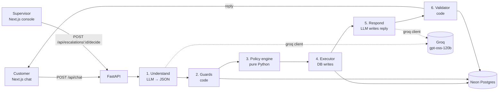

# SkyAssist: Airline Disruption Resolution Agent

**AIONOS Agentic AI Factory, Assignment 3 (Customer-Facing Resolution Agent)**

A customer-facing agent that handles airline disruptions (cancellations and delays). It understands what the customer wants, applies the airline's service rules correctly every time, carries out the actions it is allowed to take, and hands everything else to a human with a complete case summary. Every decision is traceable to a rule ID and recorded in a tamper-evident audit log.

The agent states nothing that is not in the data pack. Where the data pack is silent, the gap is listed in section 5 and handled without inventing data.

---

## 1. Problem statement

Build an agent for a realistic airline disruption journey that:

- Understands the customer's intent
- Asks only necessary questions
- Uses the supplied data and policies
- Recommends or executes the correct next action
- Handles an angry or confused customer
- Escalates when authority is missing
- Preserves a clear conversation and action record

The agent must handle the three scenarios in the data pack (Priya Nair, Arvind Kulkarni, Meher Kaur) using only the supplied data.

---

## 2. Design principle

**The LLM handles language. Code makes decisions.**

The LLM is used for two jobs only:

1. Turning a free-text customer message into structured JSON (intents, details, sentiment, flags).
2. Writing a polite reply from a list of decisions that code has already made.

Everything the evaluators check is plain Python: delay calculation, compensation bands, fare-difference limits, refund rules, escalation triggers and privacy checks. The LLM cannot grant, deny or invent anything. A validator checks every reply against the decisions before the customer sees it.

We deliberately do not use RAG or a vector database. The whole policy set fits in a few hundred tokens and is encoded as rules, which is more reliable than retrieval.

---

## 3. Tech stack

| Layer | Choice |
|---|---|
| Frontend | Next.js (App Router), TypeScript, Tailwind CSS. No component library. Lives in `frontend/`. |
| Backend | FastAPI (Python), deployed as Vercel serverless functions. Lives in `backend/`. |
| LLM | Groq, `openai/gpt-oss-120b`, called through the `groq` Python library, JSON-schema structured outputs, temperature 0 |
| Database | Neon Postgres (pooled connection string), accessed with `psycopg` |
| Hosting | Vercel (Hobby plan), two projects from one GitHub repo — one rooted at `frontend/`, one at `backend/` — for independent, simpler deploys |
| Tests | `pytest` |

Not used: the Vercel AI SDK, LangChain, or any agent framework. The loop is small enough to write directly, and doing so keeps every step visible and testable.

---

## 4. Source data (from the data pack)

The data pack sets the exercise on **Wednesday 23 September 2026** and gives no time of day. The simulated clock is **10:00 IST** (assumption A-14, set by `SIM_NOW`).

### 4.1 Customers

| Name | Tier | PNR | Contact | History (12 months) |
|---|---|---|---|---|
| Priya Nair | Gold | SK4821X | priya.nair@example.com, +91-98xxxxxxx1 | 6 flights, 1 prior complaint (delayed baggage, resolved with voucher) |
| Arvind Kulkarni | Silver | TR1190B | arvind.kulkarni@example.com, +91-98xxxxxxx2 | 3 flights, no prior complaints |
| Meher Kaur | Platinum | WL7742 | meher.kaur@example.com, +91-98xxxxxxx3 | 10 flights, 1 prior complaint (overbooking, resolved with tier upgrade) |

Prior complaints and how they were resolved are context only. They never change what a customer is entitled to.

### 4.2 Bookings

| Customer | PNR | Flight | Route | Date | Scheduled | Status |
|---|---|---|---|---|---|---|
| Priya Nair | SK4821X | SK-204 | Delhi → Goa | Wed 23 Sep 2026 | 18:40 | Cancelled (operational reasons) |
| Priya Nair | SK4821X | Return (flight number not given) | Goa → Delhi | Fri 25 Sep 2026 | 16:20 | Unaffected |
| Arvind Kulkarni | TR1190B | SK-118 | Mumbai → Bengaluru | Wed 23 Sep 2026 | 07:10 | Delayed 4h (new departure 11:10) |
| Meher Kaur | WL7742 | SK-305 | Delhi → Hyderabad | Wed 23 Sep 2026 | 14:00 | Delayed 6h (new departure 20:00) |

### 4.3 Scenario facts

| Source | Fact |
|---|---|
| Scenario 3 | Meher asks to move to "a different, higher-fare flight". The fare difference for that flight is **₹2,000**. No flight number, time or route details are given. |

This is stored in `fare_quotes` exactly as given (section 11), with its source recorded.

### 4.4 Service rules

- **Cancellation rebooking:** airline-caused cancellation → free rebooking on the next available flight within 24 hours, or a full refund, customer's choice.
- **Delay compensation:** under 3 hours → ₹500 meal voucher. More than 3 hours → meal voucher + lounge access. More than 5 hours → meal voucher + hotel accommodation covering only the delayed hours (not a full night's stay).
- **Refund processing:** refunds for airline-caused cancellations are processed in full within 7 business days, to the original payment method only.
- **Fare difference:** a customer who voluntarily rebooks onto a higher-fare flight (not airline-caused) pays the difference. Agents cannot waive fare differences above ₹1,500 without supervisor approval.
- **Loyalty tier:** Gold and Platinum get priority rebooking (first access to next-available seats) but no additional compensation beyond standard policy.

### 4.5 Allowed vs prohibited actions

**Allowed:** rebook on the next available flight within 24 hours at no charge (airline-caused disruption); issue meal vouchers and lounge access per the delay rule; arrange hotel accommodation for the delayed-hours portion where the delay qualifies; initiate a refund for airline-caused cancellations; give customers their own booking and flight status.

**Prohibited (must escalate to a human):** approving compensation beyond the stated policy amounts; waiving a fare difference above ₹1,500; exceptions for disruptions not caused by the airline (e.g. a missed flight); legal threats or formal complaints (escalate immediately); refunds to a payment method other than the original.

### 4.6 Sample prior conversations

Samples A, B and C are used **only as a tone reference** for the reply writer. They are never a source of policy or facts, as the data pack instructs.

---

## 5. Assumptions and data gaps

Each assumption is shown in the UI where it applies (tagged with its ID) and listed in `ASSUMPTIONS.md`. Where possible, a gap is handled by *not stating* something rather than assuming a value.

| ID | Gap in the data pack | How we handle it |
|---|---|---|
| A-01 | No flight inventory is supplied, but rebooking needs a "next available flight". | **No flights are invented.** A rebooking is submitted as a request carrying only the facts the rules allow: route, "next available flight within 24 hours", tier priority, no charge. The reply says the reservations system will confirm the exact flight. Inventory lookup is outside the data pack and listed as a production integration (section 19). |
| A-02 | The meal voucher amount (₹500) is only stated for delays under 3 hours. | The agent states ₹500 only for delays under 3 hours. For longer delays it says "a meal voucher", with no amount. |
| A-03 | Read literally, a 6-hour delay also satisfies "more than 3 hours", which would add lounge access to the over-5h band. | **Interpretation:** the bands are exclusive tiers, each line being the complete package for that tier (each line restates "meal voucher +"). So over 5h = meal voucher + hotel, no lounge. We choose this because granting unlisted compensation is a prohibited action. If a customer in the over-5h band asks for lounge access, the agent escalates. |
| A-04 | A delay of exactly 3 or exactly 5 hours is not covered ("under 3", "more than 3", "more than 5"). | Lower band applied, flagged, escalation offered. Not triggered by the three scenarios (4h and 6h). |
| A-05 | The original payment method is not in the data. "Cash refund" in common usage often means money back rather than a voucher. | The agent never names a payment method. It confirms the refund goes to the original payment method. It escalates only if the customer then explicitly asks for a different method (physical cash, another card, another account). |
| A-06 | The cancellation rule does not cover the unaffected return leg. | The agent tells the customer the return leg is still booked. Any change, cancellation or refund of that leg is escalated. |
| A-07 | The rules do not say whether the agent may waive fare differences of ₹1,500 or less, and waiving is not on the allowed-actions list. | The agent never waives any fare difference. |
| A-08 | The rules do not say whether delay compensation still applies if the customer moves to a different flight. | No rule is made. Compensation already issued stays, and the question is written into the handoff packet for the human. |
| A-09 | No authentication method is specified. | PNR + last name, matched against the database. PNR format and length are not validated (WL7742 has 6 characters, the others 7). |
| A-10 | "Within 24 hours" has no stated reference point (scheduled departure, time of cancellation, or time of request). | Not computed. The phrase is passed to the rebooking request exactly as the rule states it. If reservations cannot find a seat, the case is escalated and the refund option remains open. |
| A-11 | "Full refund" could mean the cancelled flight or the whole PNR (which includes the return leg). | The refund covers the cancelled flight, SK-204. The return leg is handled by A-06. |
| A-12 | Meher's delay is airline-caused, but free rebooking is only granted for **cancellations**. | A delay does not give free rebooking. Moving to a different, higher-fare flight is treated as voluntary, so the fare-difference rule applies. |
| A-13 | A paid flight change (customer pays the difference) is not on the allowed-actions list. | The agent quotes the ₹2,000 difference but does not process a paid change. If the customer wants to pay, it is handed to a human. If the customer wants the difference waived, it goes to a supervisor for approval. |
| A-14 | The data pack gives the date but no time of day. | `SIM_NOW` = Wed 23 Sep 2026, 10:00 IST. At that time Arvind's delayed flight (11:10) has not yet departed. |
| A-15 | "Within 7 business days" depends on a holiday calendar that is not supplied (counting from Wed 23 Sep lands on Fri 2 Oct, Gandhi Jayanti). | The agent never calculates a refund date. It says "processed in full within 7 business days". |

---

## 6. Architecture



`frontend/` and `backend/` deploy as two separate Vercel projects from one repo. The browser only
ever calls the frontend's own origin (`/api/*`); Next.js rewrites (`frontend/next.config.ts`) proxy
those requests server-side to `BACKEND_URL`, so the backend never needs CORS configured. Locally
`BACKEND_URL` defaults to `http://127.0.0.1:8000` (uvicorn); in production it's set to the deployed
backend project's URL.

### 6.1 Per-message pipeline

| Step | Module | Type | What it does |
|---|---|---|---|
| 1 | `understand.py` | LLM | Converts the customer message plus recent context into the `Understanding` JSON (section 7.1). Handles several intents in one message, e.g. "refund and an upgrade". |
| 2 | `guards.py` | Code | Legal/complaint keyword backstop, privacy check (logged-in PNR only), ignores tier claims made in chat, flags prompt injection, detects disruptions not caused by the airline. |
| 3 | `policy.py` | Code | Takes the booking, customer, session state and intents, and returns `Decision` objects, each with a rule ID. |
| 4 | `executor.py` | Code | Runs decisions with status `execute`: writes actions, creates escalations, writes audit entries. Idempotent. |
| 5 | `respond.py` | LLM | Writes the reply. Its only inputs are the decisions, the customer's first name, the sentiment and the tone samples. It never sees policy text, so it cannot reinterpret it. |
| 6 | `validator.py` | Code | Checks the reply against the decisions (section 10). On failure: regenerate once, then build the reply from `templates.py`. |

Button clicks (`POST /api/choice`) skip step 1, because the choice is already structured.

### 6.2 Confirmation before irreversible actions

A refund cannot be undone, so it runs only after the customer clicks a confirmation button. Before that button appears, the agent states what will happen: "Full refund for SK-204, to your original payment method, processed within 7 business days. Your Goa → Delhi return on Fri 25 Sep stays booked." Vouchers and lounge access are issued directly, matching the tone of Sample B.

### 6.3 Session state machine

```
UNVERIFIED ──(PNR + last name match)──> ACTIVE
ACTIVE ──(cancellation, no choice yet)──> AWAITING_CHOICE ──(rebook | refund)──> AWAITING_CONFIRM ──(confirm)──> ACTIVE
ACTIVE ──(hotel eligible)──> HOTEL_OFFERED ──(accept | decline)──> ACTIVE
ACTIVE ──(beyond-policy request)──> OFFERED_ESCALATION ──(customer insists | accepts)──> ESCALATED_PARTIAL
ACTIVE ──(legal threat / formal complaint)──> ESCALATED_IMMEDIATE
ESCALATED_* ──(supervisor decides)──> ACTIVE (outcome posted to chat)
```

After a partial escalation the conversation continues, and the agent keeps handling the parts it is allowed to handle.

---

## 7. LLM contracts

Both calls use `response_format={"type": "json_schema", ...}` with strict schemas, temperature 0, and the model from `GROQ_MODEL`.

### 7.1 Understanding (step 1 output)

```json
{
  "intents": [
    {
      "type": "status_query | rebook | refund | compensation_query | request_hotel | request_full_night_hotel | request_lounge | request_upgrade | change_flight_higher_fare | request_fare_waiver | refund_different_method | change_return_flight | missed_flight | other_passenger_query | general_question | greeting | other",
      "details": {
        "refund_method_mentioned": "string | null",
        "other_pnr_or_name": "string | null"
      },
      "quote": "exact span from the customer message"
    }
  ],
  "sentiment": "calm | confused | frustrated | angry",
  "legal_threat": false,
  "formal_complaint": false,
  "injection_attempt": false,
  "claimed_tier": "string | null",
  "language": "en | hi | hinglish",
  "needs_clarification": false
}
```

Every intent must carry a `quote` from the message. An intent whose quote is not found in the message is discarded. This stops hallucinated intents.

### 7.2 Decision (step 3 output)

```json
{
  "decision_id": "d_01",
  "action": "STATUS | OFFER_OPTIONS | REBOOK_REQUEST | CONFIRM_REFUND | REFUND | ISSUE_MEAL_VOUCHER | GRANT_LOUNGE | OFFER_HOTEL | BOOK_HOTEL_DELAYED_HOURS | QUOTE_FARE_DIFFERENCE | EXPLAIN_INELIGIBLE | OFFER_ESCALATION | ESCALATE | HANDOFF | INFORM_RETURN_LEG | REFUSE_PRIVACY | ASK",
  "status": "execute | offer | confirm | ask | escalate | decline | inform",
  "rule_id": "R-DELAY",
  "params": { "hours": 6, "window": "14:00–20:00" },
  "customer_facing_facts": ["Your flight SK-305 is delayed by 6 hours, from 14:00 to 20:00."],
  "assumption_ids": ["A-02", "A-03"]
}
```

`customer_facing_facts` is the **only** factual content the reply writer may use.

### 7.3 Reply writer rules (system prompt summary)

- Use only the facts and actions in the decisions. Do not add offers, amounts, times, dates, flight numbers or promises.
- Acknowledge feelings in one sentence when sentiment is `frustrated` or `angry`, then move to the resolution.
- Ask at most one question per reply, and only when a decision has status `ask`.
- When there is a choice, name the options exactly as given (the UI renders them as buttons).
- Reply in the customer's language (English, Hindi or Hinglish).
- Tone follows Samples A–C. Never quote them.

---

## 8. Policy engine

`policy.py` contains pure functions with no I/O and no LLM calls. Each returns `Decision` objects.

| Rule ID | Trigger | Outcome |
|---|---|---|
| `R-STATUS` | Status query | The customer's own booking and flight status. |
| `R-CANCEL` | Booking cancelled, airline-caused | `OFFER_OPTIONS`: free rebooking on the next available flight within 24 hours, or a full refund. The customer chooses. |
| `R-REBOOK` | Customer chooses rebooking | `REBOOK_REQUEST` executed: route, "next available within 24 hours", no charge, tier priority. Flight confirmed by reservations (A-01, A-10). |
| `R-TIER` | Rebooking for Gold/Platinum | Priority flag set on the request. No additional compensation, ever. |
| `R-REFUND` | Customer chooses refund | `CONFIRM_REFUND`, then `REFUND` executed: SK-204 in full, original payment method, "processed within 7 business days" (A-05, A-11, A-15). `INFORM_RETURN_LEG` included (A-06). |
| `R-REFUND-METHOD` | Explicit request for a different refund method | `ESCALATE` (prohibited action). |
| `R-DELAY` | Booking delayed | Delay = new departure − scheduled departure, computed in code. Tiers are exclusive (A-03). Under 3h: `ISSUE_MEAL_VOUCHER` ₹500. Over 3h to 5h: `ISSUE_MEAL_VOUCHER` (no amount stated, A-02) + `GRANT_LOUNGE`. Over 5h: `ISSUE_MEAL_VOUCHER` + `OFFER_HOTEL` for the delayed hours only; `BOOK_HOTEL_DELAYED_HOURS` on acceptance. Exactly 3h or 5h: A-04. |
| `R-FARE` | Customer wants a different, higher-fare flight | `QUOTE_FARE_DIFFERENCE` from `fare_quotes` (₹2,000 for Meher). Customer wants to pay → `HANDOFF` to a human (A-13). Customer wants a waiver → `ESCALATE` to a supervisor (above ₹1,500, and A-07). |
| `R-BEYOND` | Request beyond policy (upgrade, full-night hotel, hotel under 5h, lounge above 5h, extra compensation) | First time: `EXPLAIN_INELIGIBLE` (what the policy does give) + `OFFER_ESCALATION` as a button. If the customer insists or accepts: `ESCALATE`. Applied the same way to every customer. |
| `R-LEGAL` | Legal threat or formal complaint | `ESCALATE` immediately. Actions already taken stand. |
| `R-NONAIRLINE` | Missed flight or other disruption not caused by the airline | `ESCALATE`. |
| `R-RETURN` | Change or refund of an unaffected leg | `ESCALATE` (A-06). |
| `R-PRIVACY` | Question about another passenger or PNR | `REFUSE_PRIVACY`. |

Anger never changes what a customer is entitled to. It only changes the tone of the reply.

**Why beyond-policy requests are explained first rather than escalated at once:** declining something the policy plainly excludes (for example a hotel for a 4-hour delay) is applying the policy, which needs no extra authority. Only an *exception* to policy needs a human, so the agent escalates when the customer asks for one.

---

## 9. Expected outcomes (ground truth for tests)

### Scenario 1: Priya Nair (Gold, SK4821X, SK-204 cancelled)

| Customer says | Agent does | Rule |
|---|---|---|
| Asks about SK-204 | States it is cancelled for operational reasons. Offers free rebooking on the next available flight within 24 hours or a full refund, as buttons. | R-STATUS, R-CANCEL |
| "I'm furious, I want a full cash refund" | One sentence acknowledging her frustration. Shows the refund confirmation: SK-204 in full, original payment method, processed within 7 business days, return leg stays booked. On confirmation, the refund is initiated. Physical cash is not offered. If she then explicitly insists on cash or another method → escalation. | R-REFUND, R-REFUND-METHOD |
| "…plus a free business-class upgrade on my return" | Explains the upgrade is beyond policy (Gold gives priority rebooking, not additional compensation). Offers escalation. Escalates if she insists. Nothing about the upgrade is promised. | R-BEYOND, R-TIER |
| Refund on the outbound but an upgrade on the return | The two requests do not fit together (no outbound flight, but a return flight from Goa). The agent does not guess. It states the return leg remains booked, and any change to it is escalated. | R-RETURN |
| Chooses rebooking instead | Rebooking request submitted with Gold priority and no charge. The reply says reservations will confirm the exact flight. No flight number or time is stated. | R-REBOOK, R-TIER |

### Scenario 2: Arvind Kulkarni (Silver, TR1190B, SK-118 delayed 4h)

| Customer says | Agent does | Rule |
|---|---|---|
| Frustrated about the delay and his missed meeting | One sentence acknowledging it. States the delay (07:10 → 11:10, 4 hours). Issues a meal voucher (no amount stated) and lounge access. No questions asked: the data says "meeting", which is not compensable. | R-DELAY |
| "I want a hotel since it's such a long delay" | Explains that hotel accommodation applies to delays of more than 5 hours and his is 4. Offers escalation. Escalates if he insists. | R-BEYOND |

### Scenario 3: Meher Kaur (Platinum, WL7742, SK-305 delayed 6h)

| Customer says | Agent does | Rule |
|---|---|---|
| Asks what she gets | States the delay (14:00 → 20:00, 6 hours). Issues a meal voucher (no amount stated). Offers a hotel for the delayed hours (14:00–20:00) and books it if she accepts. No lounge (A-03). | R-DELAY |
| "I want a full night's hotel stay" | Explains the policy covers only the delayed hours, not a full night. Offers escalation. Escalates if she insists. | R-BEYOND |
| "Move me to a different flight instead of waiting" (fare difference ₹2,000) | Explains that a delay does not include free rebooking (A-12) and that the alternative flight has a fare difference of ₹2,000. Two buttons: **Pay the difference** → handed to a human to process (A-13); **Request a waiver** → escalated to a supervisor, since the agent cannot waive more than ₹1,500. Her Platinum tier and previous complaint do not change this. No flight number or time is stated. | R-FARE, R-TIER |

---

## 10. Guardrails and correctness harness

| Risk | Control |
|---|---|
| LLM misreads a key choice | Buttons for every choice and confirmation. The choice never depends on free text. |
| LLM misses a legal threat | Keyword backstop (`legal`, `lawyer`, `sue`, `court`, `consumer forum`, `formal complaint`, Hindi equivalents) OR the LLM flag → escalate. |
| LLM invents an intent | Each intent must include a quote that exists in the message, otherwise it is dropped. |
| Reply states something not decided | The validator rejects a reply containing: any ₹ amount not in the decisions; any hour count or time not in the decisions; any flight number other than those in `bookings`; any calendar date for a refund; the words upgrade, business class, full night, waive(d) or compensation unless a decision covers them. On failure: regenerate once, then use the template. |
| Invented flight data | There is no inventory table. Flight numbers can only come from `bookings`, and the validator enforces it. |
| Customer claims a higher tier | The tier is always read from the database. The claim is logged and ignored. |
| Customer asks about another booking | Only the logged-in PNR is accessible. Refused with `R-PRIVACY`. |
| Prompt injection ("ignore your rules") | The policy engine only reads intents, so the text has no effect. Flagged and logged. |
| Duplicate actions | `UNIQUE (pnr, type)` constraint on `actions`. The executor checks before writing. |
| Accidental refund | Refunds run only after the confirmation button. |
| LLM provider rate limit or outage | One retry with backoff. Then: buttons still work, and replies are built by `templates.py`. The chat never shows an error. |
| Audit tampering | `audit_log` entries are hash-chained: `hash = sha256(prev_hash + event + payload + ts)`. The supervisor page shows the chain status. |

---

## 11. Data model (Neon Postgres)

```sql
CREATE TABLE customers (
  id            SERIAL PRIMARY KEY,
  name          TEXT NOT NULL,
  last_name     TEXT NOT NULL,
  tier          TEXT NOT NULL CHECK (tier IN ('Silver','Gold','Platinum')),
  email         TEXT,
  phone         TEXT,
  history       TEXT
);

CREATE TABLE bookings (
  id            SERIAL PRIMARY KEY,
  pnr           TEXT NOT NULL,
  customer_id   INT REFERENCES customers(id),
  leg           INT NOT NULL,
  flight_no     TEXT,                 -- NULL for Priya's return (not given)
  origin        TEXT NOT NULL,
  destination   TEXT NOT NULL,
  sched_dep     TIMESTAMPTZ NOT NULL,
  status        TEXT NOT NULL CHECK (status IN ('scheduled','cancelled','delayed')),
  new_dep       TIMESTAMPTZ,
  cause         TEXT
);

CREATE TABLE fare_quotes (
  id            SERIAL PRIMARY KEY,
  pnr           TEXT NOT NULL,
  description   TEXT NOT NULL,        -- 'Alternative higher-fare flight requested by customer'
  fare_diff_inr INT NOT NULL,         -- 2000
  source        TEXT NOT NULL         -- 'Data pack, Scenario 3'
);

CREATE TABLE sessions (
  id            UUID PRIMARY KEY,
  pnr           TEXT NOT NULL,
  state         TEXT NOT NULL,
  context       JSONB NOT NULL DEFAULT '{}',
  created_at    TIMESTAMPTZ DEFAULT now()
);

CREATE TABLE messages (
  id            BIGSERIAL PRIMARY KEY,
  session_id    UUID REFERENCES sessions(id),
  role          TEXT NOT NULL CHECK (role IN ('customer','agent','system','supervisor')),
  content       TEXT NOT NULL,
  meta          JSONB,
  created_at    TIMESTAMPTZ DEFAULT now()
);

CREATE TABLE actions (
  id            BIGSERIAL PRIMARY KEY,
  session_id    UUID REFERENCES sessions(id),
  pnr           TEXT NOT NULL,
  type          TEXT NOT NULL,
  params        JSONB NOT NULL,
  rule_id       TEXT NOT NULL,
  status        TEXT NOT NULL,        -- issued | submitted | offered | booked | initiated
  created_at    TIMESTAMPTZ DEFAULT now(),
  UNIQUE (pnr, type)
);

CREATE TABLE escalations (
  id              BIGSERIAL PRIMARY KEY,
  session_id      UUID REFERENCES sessions(id),
  pnr             TEXT NOT NULL,
  kind            TEXT NOT NULL CHECK (kind IN ('approval','handoff','immediate')),
  reason          TEXT NOT NULL,
  rule_id         TEXT NOT NULL,
  packet          JSONB NOT NULL,
  status          TEXT NOT NULL DEFAULT 'pending' CHECK (status IN ('pending','approved','denied','completed')),
  supervisor_note TEXT,
  created_at      TIMESTAMPTZ DEFAULT now(),
  resolved_at     TIMESTAMPTZ
);

CREATE TABLE audit_log (
  id            BIGSERIAL PRIMARY KEY,
  session_id    UUID,
  event         TEXT NOT NULL,
  payload       JSONB NOT NULL,
  prev_hash     TEXT NOT NULL,
  hash          TEXT NOT NULL,
  ts            TIMESTAMPTZ DEFAULT now()
);
```

Escalation kinds:
- **approval:** the customer wants an exception (upgrade, full night, fare waiver). The supervisor approves or denies.
- **handoff:** an allowed outcome the agent cannot process (paid flight change, rebooking with no seat found). The human completes it.
- **immediate:** legal threat or formal complaint.

`backend/seed.py` loads section 4 only. `POST /api/reset` truncates the session tables and re-seeds.

Serverless functions cannot keep a connection pool alive, so each request opens one connection through Neon's **pooled** endpoint.

---

## 12. Escalation handoff packet

What the human sees, so they never need to re-ask the customer:

```json
{
  "kind": "approval",
  "customer": { "name": "Meher Kaur", "tier": "Platinum", "pnr": "WL7742" },
  "booking": "SK-305 Delhi → Hyderabad, scheduled 14:00, delayed 6h to 20:00",
  "already_done": ["Meal voucher issued (R-DELAY)", "Hotel for delayed hours 14:00–20:00 offered (R-DELAY)"],
  "requested": "Waive the ₹2,000 fare difference to move to the alternative flight she asked about",
  "blocked_by": "R-FARE: agent cannot waive fare differences above ₹1,500",
  "sentiment": "frustrated",
  "customer_quote": "Just move me to the other flight, I'm not paying extra.",
  "notes": ["A-08: policy does not say whether delay compensation stays if she moves flights"],
  "transcript_session_id": "…"
}
```

On **Approve**, the executor records the approved outcome and posts a system message to the customer's chat. On **Deny**, the supervisor's note is turned into a reply and posted. On **Complete** (handoffs), the human confirms the task is done. All three are written to the audit log.

---

## 13. API

| Method | Path | Body / params | Returns |
|---|---|---|---|
| POST | `/api/session` | `{ pnr, last_name }` | `{ session_id, customer, bookings }` or 401 |
| POST | `/api/chat` | `{ session_id, message }` | `{ reply, choices[], decisions[], actions[], escalations[], assumptions[] }` |
| POST | `/api/choice` | `{ session_id, choice_id }` | Same as `/api/chat` |
| GET | `/api/session/{id}` | none | Messages, actions, escalations, assumptions applied |
| GET | `/api/escalations` | header `X-Supervisor-Passcode` | All escalations with packets |
| POST | `/api/escalations/{id}/decide` | `{ decision: approve \| deny \| complete, note }` + passcode header | Updated escalation |
| GET | `/api/audit/verify` | passcode header | `{ valid: bool, entries: n }` |
| POST | `/api/reset` | passcode header | Re-seeds the database |
| GET | `/api/health` | none | DB and LLM reachability |

---

## 14. User interface

**Visual style:** background `#f5f5f5`, white cards, `rounded-2xl` corners, soft shadows, rounded buttons, one accent colour, system font stack, generous spacing. Tailwind only.

### 14.1 Customer page (`/`)

- **Login card:** PNR and last-name fields and one button. A small "Demo bookings" hint lists the three test PNRs.
- **Chat (left, main):** message bubbles, a typing indicator, and buttons under the agent's message whenever a choice or confirmation is pending (e.g. "Rebook on next available flight" / "Full refund"; "Confirm refund"; "Yes, book the hotel"; "Pay the difference" / "Request a waiver"; "Yes, escalate" / "No thanks").
- **Action panel (right):** a booking summary card, then a timeline of actions (each with its rule ID, status and parameters), escalations with a status pill (pending / approved / denied / completed), and any assumptions applied, tagged with their IDs.
- On mobile, the action panel becomes a tab above the chat.
- The chat polls `GET /api/session/{id}` every 5 seconds so supervisor decisions appear without a refresh.

### 14.2 Supervisor console (`/supervisor`)

- Passcode field (checked against `SUPERVISOR_PASSCODE`).
- Escalation list, pending first, showing kind, customer, reason and time waiting.
- Detail view: the full handoff packet, a transcript link, a note field, and **Approve** / **Deny** (approvals) or **Mark complete** (handoffs).
- Footer: audit-chain status (`valid` / `broken`) and a demo reset button.

---

## 15. Repository layout

Two independently deployable projects in one repo, `frontend/` and `backend/` (see §6 and §17 for
why). Locally, Next.js and uvicorn run as two separate processes.

```
.
├── frontend/
│   ├── app/
│   │   ├── page.tsx              # login → chat + action panel
│   │   ├── supervisor/page.tsx   # supervisor console
│   │   ├── components/           # ChatBubble, ChoiceButtons, ActionPanel, EscalationCard
│   │   └── lib/api.ts            # fetch wrappers
│   ├── package.json
│   └── next.config.ts            # rewrites /api/* to BACKEND_URL
├── backend/
│   ├── api/
│   │   └── index.py              # FastAPI app entry (Vercel serverless)
│   ├── agent/
│   │   ├── understand.py
│   │   ├── guards.py
│   │   ├── policy.py
│   │   ├── executor.py
│   │   ├── respond.py
│   │   ├── validator.py
│   │   └── templates.py
│   ├── llm.py                    # groq client, retry/backoff
│   ├── db.py                     # psycopg connection helper
│   ├── schemas.py                # Pydantic models (Understanding, Decision, Packet)
│   ├── assumptions.py            # A-01 … A-15 as data, used by policy and the API
│   ├── clock.py                  # SIM_NOW
│   ├── audit.py                  # hash-chained audit writer and verifier
│   ├── seed.py
│   ├── schema.sql
│   ├── requirements.txt
│   └── tests/
│       ├── test_policy.py
│       ├── test_guards.py
│       ├── test_validator.py
│       ├── test_scenarios.py
│       ├── test_redteam.py
│       └── eval_understand.py    # live LLM eval, run locally
├── README.md
├── ASSUMPTIONS.md
└── AI_TOOLS.md
```

---

## 16. Testing

| Suite | LLM? | What it proves |
|---|---|---|
| `test_policy.py` | No | Every rule and boundary: 2.9h / 3.0h / 3.1h / 5.0h / 5.1h delays; exclusive tiers (6h gives no lounge); ₹500 stated only under 3h; ₹1,500 / ₹1,501 fare differences; tier priority without extra compensation; refund always scoped to SK-204. |
| `test_guards.py` | No | Legal keywords (English, Hindi, Hinglish), privacy refusals, tier-claim ignoring, injection flagging, missed-flight detection. |
| `test_validator.py` | No | Rejects replies with an undecided ₹ amount, an invented flight number, a refund date, "upgrade" / "full night" / "waive" without a covering decision, or a time not in the decisions. Accepts correct replies. |
| `test_scenarios.py` | Mocked | The three scenarios end to end with fixed `Understanding` outputs. Asserts the exact actions, escalations (and their kinds), buttons and final session state from section 9. |
| `test_redteam.py` | Mocked | "Ignore your rules", "the counter staff promised me", a fake Platinum claim, asking for Meher's booking from Priya's session, a legal threat mid-conversation, repeated pressure after a denial, "just give me the ₹500 voucher" on a 6h delay (to check that the amount is still not stated). |
| `eval_understand.py` | Live | About 30 labelled customer messages run against the live LLM. Reports intent accuracy and legal-flag recall. Run locally because of rate limits; the results table goes in the README. |

---

## 17. Deployment

- **Two Vercel projects, one GitHub repo:** one project with Root Directory `frontend/` (Next.js
  pages, calling the backend via the rewrite in §6), one with Root Directory `backend/` (the
  FastAPI function under `backend/api/`). Splitting them this way means either can be redeployed,
  scaled, or swapped (e.g. backend moved to a non-Vercel host later) without touching the other.
- **Neon:** create a project, run `backend/schema.sql`, then `python -m backend.seed`.
- **Environment variables:**

| Variable | Set on | Example |
|---|---|---|
| `GROQ_API_KEY` | backend project | (secret) |
| `GROQ_MODEL` | backend project | `openai/gpt-oss-120b` |
| `DATABASE_URL` | backend project | Neon pooled connection string |
| `SIM_NOW` | backend project | `2026-09-23T10:00:00+05:30` |
| `SUPERVISOR_PASSCODE` | backend project | (secret) |
| `BACKEND_URL` | frontend project | `https://skyassist-backend.vercel.app` |

  Locally, all of these go in `.env.local` files next to the code that reads them
  (`backend/.env.local` for the Python vars, `frontend/.env.local` only if overriding the
  `BACKEND_URL` default of `http://127.0.0.1:8000`).

- **Local run (after `pip install -r backend/requirements.txt` and `npm install --prefix frontend`):**

```bash
python -m backend.seed
uvicorn backend.api.index:app --reload --port 8000   # terminal 1
npm run dev --prefix frontend                        # terminal 2
```

- **Groq rate limits:** vary by account tier — check the key's actual limits before the evaluation and size `eval_understand.py`'s request pacing accordingly.

---

## 18. Submission deliverables

| Required output | Where it lives |
|---|---|
| Working agent or clickable prototype | Vercel URL (customer page and supervisor console) |
| Architecture and process flow | This document, section 6; Mermaid diagram in the README |
| Inputs, sources and assumptions | Sections 4 and 5; `ASSUMPTIONS.md` |
| AI tools used and how | `AI_TOOLS.md`: `openai/gpt-oss-120b` via Groq at runtime (understanding and reply writing only), plus any coding assistants used during the build and what they were used for |
| 15-minute demo and defence, demo video | Video on Google Drive (open access) walking through all three scenarios, the escalation and handoff loop, and the test results |
| GitHub link | Public repository |
| 10-slide PPT | See below |

**Slide outline:**
1. The problem and the three customers
2. What's hidden in the data (the traps)
3. Architecture: LLM for language, code for decisions
4. The policy engine and rule IDs
5. How correctness is enforced (guards, validator, templates, no invented data)
6. Escalation, handoff and the supervisor loop
7. Scenario walkthroughs
8. Test and eval results
9. Assumptions (A-01 to A-15) and limitations
10. What changes in production

---

## 19. Limitations and path to production

- **Flight inventory:** rebooking requests carry only what the rules allow and are not matched to a specific flight. Production would call the airline's inventory and PSS (passenger service system) APIs to confirm the exact flight.
- **Payment method:** production would read the original payment method from the booking and pass refunds to the payments system.
- **Holiday calendar:** production would compute business-day refund dates from the airline's holiday calendar.
- **Authentication:** PNR + last name is enough for a demo. Production would add an OTP to the registered contact.
- **Supervisor auth:** a single passcode. Production would use SSO with roles.
- **Scale:** the current Groq key's rate limits cap throughput. A paid tier or a queue would be needed for real traffic.
- **Channels:** web chat only. The same pipeline could sit behind WhatsApp or voice, because the policy engine does not depend on the channel.